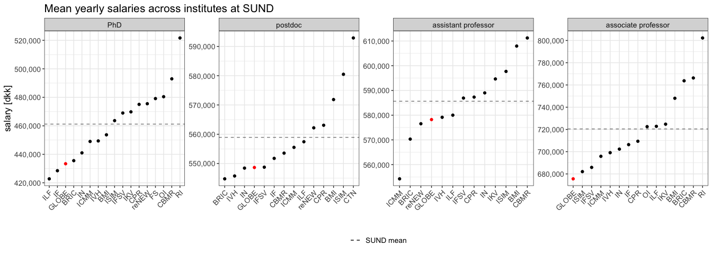
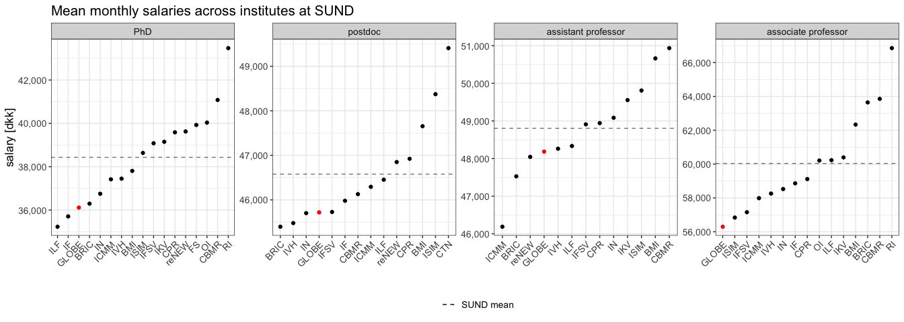

Salaries at Globe
================

``` r
library(ggplot2)
library(scales)
library(forcats)
library(tidytext)
library(dplyr)
#> 
#> Attaching package: 'dplyr'
#> The following objects are masked from 'package:stats':
#> 
#>     filter, lag
#> The following objects are masked from 'package:base':
#> 
#>     intersect, setdiff, setequal, union
library(xlsx)
```

### Read institute names and their abbreviations

``` r
inst_df <- read.xlsx("salaries.xlsx", sheetName = "institutes", header = FALSE) %>% setNames("id")
parsed_ids <- strsplit(inst_df$id, " \\(|\\)")
inst_df <- inst_df %>%
  mutate(
    name = sapply(parsed_ids, `[[`, 1),
    id = sapply(parsed_ids, `[[`, 2)
  )

inst_df
#>       id                                         name
#> 1    BMI                        BIOMEDICINSK INSTITUT
#> 2   ICMM   INSTITUT FOR CELLULÆR OG MOLEKYLÆR MEDICIN
#> 3   ISIM      INSTITUT FOR IMMUNOLOGI OG MIKROBIOLOGI
#> 4     IN                  INSTITUT FOR NEUROVIDENSKAB
#> 5     RI                       RETSMEDICINSK INSTITUT
#> 6   IFSV          INSTITUT FOR FOLKESUNDHEDSVIDENSKAB
#> 7     OI                        ODONTOLOGISK INSTITUT
#> 8    IKM                 INSTITUT FOR KLINISK MEDICIN
#> 9     IF                         INSTITUT FOR FARMACI
#> 10   ILF INSTITUT FOR LÆGEMIDDELDESIGN OG FARMAKOLOGI
#> 11   IKV        INSTITUT FOR KLINISK VETERINÆRMEDICIN
#> 12   IVH   INSTITUT FOR VETERINÆR- OG HUSDYRVIDENSKAB
#> 13 GLOBE                              GLOBE INSTITUTE
#> 14   AEM           AFDELING FOR EKSPERIMENTEL MEDICIN
#> 15   SKT  SKOLEN FOR KLINIKASSISTENTER OG TANDPLEJERE
```

### Read salary information

#### PhDs

``` r
phd_df <- read.xlsx("salaries.xlsx", sheetName = "PhD") %>%
  .[-nrow(.), c("Institut", "Avg..Fuldtidsløn", "Median")] %>%
  setNames(c("inst_id", "mean", "median")) %>%
  mutate(role = "PhD")

phd_df
#>    inst_id     mean   median role
#> 1      BMI 453679.0 435409.1  PhD
#> 2     BRIC 435545.7 406705.1  PhD
#> 3     CBMR 492969.0 492945.5  PhD
#> 4      CPR 475041.6 465580.3  PhD
#> 5       FS 479108.0 489735.3  PhD
#> 6    GLOBE 433375.4 430046.2  PhD
#> 7     ICMM 449020.4 459614.1  PhD
#> 8       IF 428493.4 435409.1  PhD
#> 9     IFSV 468979.9 465580.3  PhD
#> 10     IKV 469794.9 489735.3  PhD
#> 11     ILF 422780.0 405429.2  PhD
#> 12      IN 441022.4 435409.1  PhD
#> 13    ISIM 463636.3 462688.3  PhD
#> 14     IVH 449387.6 435967.2  PhD
#> 15      OI 480428.9 489427.5  PhD
#> 16   reNEW 475507.5 465580.3  PhD
#> 17      RI 521665.6 519906.6  PhD
```

#### Postdocs

``` r
postdoc_df <- read.xlsx("salaries.xlsx", sheetName = "postdoc") %>%
  .[-nrow(.), c("Institut", "Avg..Fuldtidsløn", "Median")] %>%
  setNames(c("inst_id", "mean", "median")) %>%
  mutate(role = "postdoc")

postdoc_df
#>    inst_id     mean   median    role
#> 1      BMI 571842.3 555456.6 postdoc
#> 2     BRIC 544764.4 539220.9 postdoc
#> 3     CBMR 553544.4 553562.1 postdoc
#> 4      CPR 563070.0 567362.1 postdoc
#> 5      CTN 592892.6 572888.7 postdoc
#> 6    GLOBE 548644.7 539220.9 postdoc
#> 7     ICMM 555516.0 539220.9 postdoc
#> 8       IF 551752.4 542752.4 postdoc
#> 9     IFSV 548743.2 539253.3 postdoc
#> 10     ILF 557440.3 539220.9 postdoc
#> 11      IN 548431.4 539220.9 postdoc
#> 12    ISIM 580480.3 574939.3 postdoc
#> 13     IVH 545742.7 539220.9 postdoc
#> 14   reNEW 562192.2 561138.2 postdoc
```

#### Assistant professors

``` r
adjunkt_df <- read.xlsx("salaries.xlsx", sheetName = "adjunkt") %>%
  .[-nrow(.), c("Institut", "Avg..Fuldtidsløn", "Median")] %>%
  setNames(c("inst_id", "mean", "median")) %>%
  mutate(role = "assistant professor")

adjunkt_df
#>    inst_id     mean   median                role
#> 1      BMI 607949.1 609861.4 assistant professor
#> 2     BRIC 570328.6 568985.5 assistant professor
#> 3     CBMR 611234.4 608270.9 assistant professor
#> 4      CPR 587307.2 591374.3 assistant professor
#> 5    GLOBE 578221.6 579809.9 assistant professor
#> 6     ICMM 554247.0 556106.7 assistant professor
#> 7     IFSV 586913.1 568851.0 assistant professor
#> 8      IKV 594647.1 586304.0 assistant professor
#> 9      ILF 580004.6 574532.6 assistant professor
#> 10      IN 589011.9 588926.9 assistant professor
#> 11    ISIM 597701.3 596315.5 assistant professor
#> 12     IVH 579141.1 573044.8 assistant professor
#> 13   reNEW 576539.8 570338.9 assistant professor
```

#### Associate professors

``` r
lektor_df <- read.xlsx("salaries.xlsx", sheetName = "lektor") %>%
  .[-nrow(.), c("Institut", "Avg..Fuldtidsløn", "Median")] %>%
  setNames(c("inst_id", "mean", "median")) %>%
  mutate(role = "associate professor")

lektor_df
#>    inst_id     mean   median                role
#> 1      BMI 748012.9 734021.6 associate professor
#> 2     BRIC 763748.7 770552.3 associate professor
#> 3     CBMR 766276.7 771566.4 associate professor
#> 4      CPR 709372.1 673612.7 associate professor
#> 5    GLOBE 675567.7 685992.2 associate professor
#> 6     ICMM 695822.0 684214.4 associate professor
#> 7       IF 706329.8 686533.4 associate professor
#> 8     IFSV 685856.6 662182.5 associate professor
#> 9      IKV 724729.3 743222.4 associate professor
#> 10     ILF 722782.6 722516.0 associate professor
#> 11      IN 702314.7 694362.8 associate professor
#> 12    ISIM 682057.3 668421.3 associate professor
#> 13     IVH 699095.0 691674.8 associate professor
#> 14      OI 722498.9 723818.6 associate professor
#> 15      RI 802266.1 672868.4 associate professor
```

#### Combine into a single tidy table

``` r
salaries_df <- rbind(phd_df, postdoc_df, adjunkt_df, lektor_df) %>%
  mutate(
    median_year = median,
    median_month = median_year / 12,
    mean_year = mean,
    mean_month = mean_year / 12,
    is_globe = inst_id == "GLOBE",
    role = factor(role, levels = c("PhD", "postdoc",
                                   "assistant professor", "associate professor"))
  ) %>%
  as_tibble

salaries_df
#> # A tibble: 59 × 9
#>    inst_id    mean  median role  median_year median_month mean_year mean_month
#>    <chr>     <dbl>   <dbl> <fct>       <dbl>        <dbl>     <dbl>      <dbl>
#>  1 BMI     453679. 435409. PhD       435409.       36284.   453679.     37807.
#>  2 BRIC    435546. 406705. PhD       406705.       33892.   435546.     36295.
#>  3 CBMR    492969. 492946. PhD       492946.       41079.   492969.     41081.
#>  4 CPR     475042. 465580. PhD       465580.       38798.   475042.     39587.
#>  5 FS      479108. 489735. PhD       489735.       40811.   479108.     39926.
#>  6 GLOBE   433375. 430046. PhD       430046.       35837.   433375.     36115.
#>  7 ICMM    449020. 459614. PhD       459614.       38301.   449020.     37418.
#>  8 IF      428493. 435409. PhD       435409.       36284.   428493.     35708.
#>  9 IFSV    468980. 465580. PhD       465580.       38798.   468980.     39082.
#> 10 IKV     469795. 489735. PhD       489735.       40811.   469795.     39150.
#> # ℹ 49 more rows
#> # ℹ 1 more variable: is_globe <lgl>
```

#### Compute mean and median

``` r
summary_df <- group_by(salaries_df, role) %>%
  summarise(
    mean_month = mean(mean_month),
    mean_year = mean(mean_year),
    median_month = median(median_month),
    median_year = median(median_year)
  )

summary_df
#> # A tibble: 4 × 5
#>   role                mean_month mean_year median_month median_year
#>   <fct>                    <dbl>     <dbl>        <dbl>       <dbl>
#> 1 PhD                     38434.   461202.       38557.     462688.
#> 2 postdoc                 46578.   558933.       45084.     541003.
#> 3 assistant professor     48803.   585634.       48317.     579810.
#> 4 associate professor     60037.   720449.       57640.     691675.
```

``` r
plot_salaries <- function(salaries_df, summary_df, stat, time) {
  salaries_df_cols <- c("inst_id", "role", paste0(stat, "_", time), "is_globe")
  summary_df_cols <- c("role", paste0(stat, "_", time))

  sal_df <- salaries_df[salaries_df_cols]
  sum_df <- summary_df[summary_df_cols]
  
  salaries_df_cols2 <- c("inst_id", "role", "stat", "is_globe")
  summary_df_cols2 <- c("role", "stat")

  names(sal_df) <- salaries_df_cols2
  names(sum_df) <- summary_df_cols2

  sal_df %>%
  mutate(factor_id = reorder_within(inst_id, stat, within = role)) %>%
  ggplot(aes(factor_id, stat, color = is_globe)) +
    geom_point() +
    geom_hline(data = sum_df, aes(yintercept = stat, linetype = paste("SUND", !!stat), alpha = 0.8)) +
    scale_x_reordered() +
    scale_y_continuous(labels = label_comma(), breaks = breaks_pretty()) +
    scale_color_manual(values = c("black", "red")) +
    scale_linetype_manual(values = "dashed") +
    guides(color = "none", size = "none", alpha = "none", linetype = guide_legend("")) +
    labs(
      title = paste(tools::toTitleCase(stat), paste0(time, "ly"), "salaries across institutes at SUND"),
      x = "",
      y = "salary [dkk]"
    ) +
    theme_bw() +
    theme(text = element_text(size = 13),
          legend.position = "bottom",
          axis.text.x = element_text(hjust = 1, angle = 45)) +
    facet_wrap(~ role, scales = "free", nrow = 1)
}
```

#### Yearly statistics

``` r
p_median_y <- plot_salaries(salaries_df, summary_df, "median", "year")
p_median_y
```

<!-- -->

``` r

p_mean_y <- plot_salaries(salaries_df, summary_df, "mean", "year")
p_mean_y
```

<!-- -->

#### Monthly statistics

These numbers are just the yearly numbers above divided by 12 (I
personally find these easier to understand than the yearly numbers, in
the context of monthly rent and other expenses, so I’m showing these as
well).

``` r
p_median_m <- plot_salaries(salaries_df, summary_df, "median", "month")
p_median_m
```

<!-- -->

``` r

p_mean_m <- plot_salaries(salaries_df, summary_df, "mean", "month")
p_mean_m
```

<!-- -->

#### Save all figures to a PDF

``` r
pdf("salaries.pdf", width = 13, height = 5)
print(p_median_y)
print(p_mean_y)
print(p_median_m)
print(p_mean_m)
dev.off()
#> quartz_off_screen 
#>                 2
```
